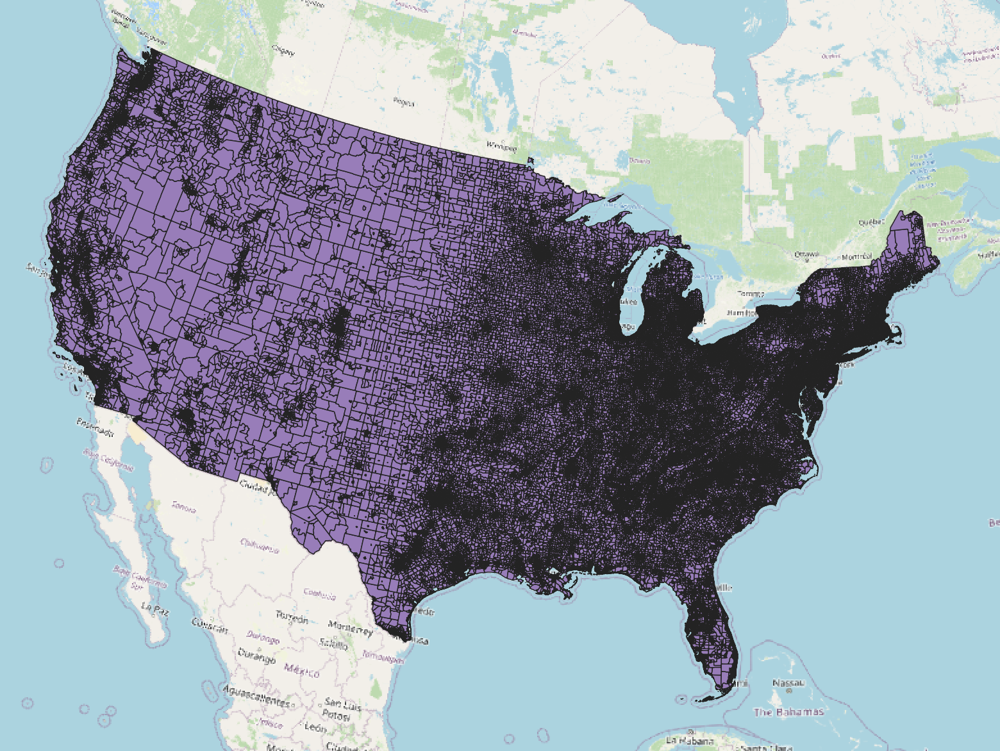
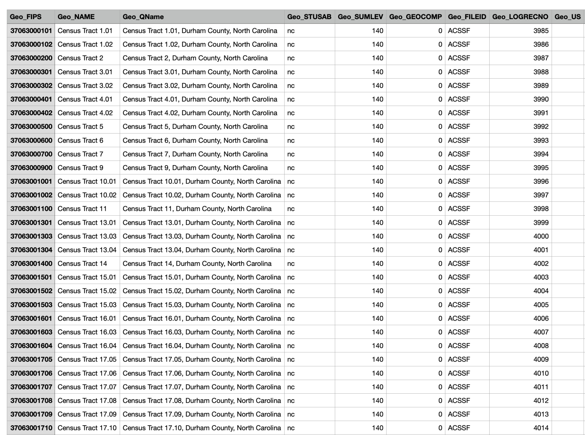
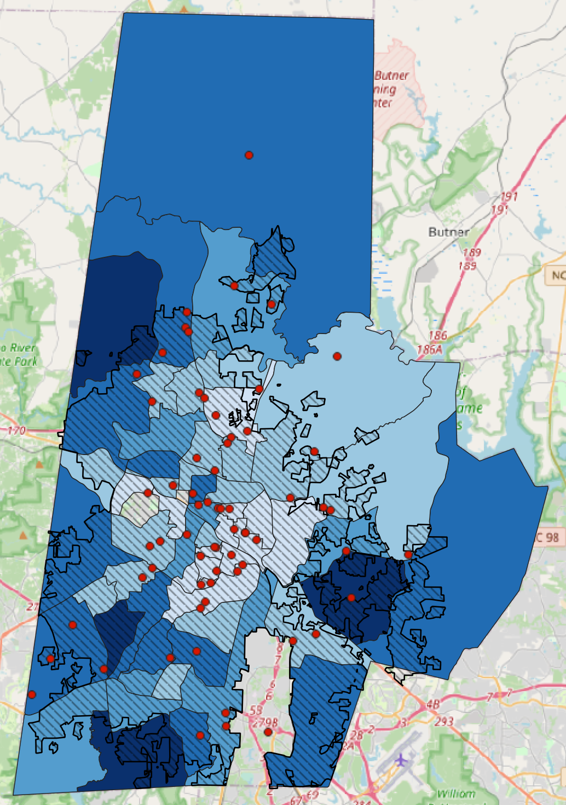

# Income and School Performance in Durham County, NC

## Introduction
This research project explores the relationship between median household income and school performance in Durham County, North Carolina using QGIS. Education is a critical determinant of quality of life, with higher education levels associated with higher income, less stress, better health, and increased life expectancy (Cutler, 2014). We also know that higher education levels are correlated with higher median income (NCES). Given this connection, this project seeks to understand how income affects school performance in the local area, if at all. Durham County, with its growing population, serves as an ideal study area. I used performance grades from the NC Department of Public Instruction (NCDPI) as a metric for school quality, focusing on elementary, middle, and high schools. Performance grades are based on achievement scores (80%), which rely heavily on standardized tests, and school growth (20%) (NCDPI, 2023).

Research question: **How does median household income affect public and charter school performance grades in Durham County, North Carolina?**

## Methods

### Data Collection
- **Census Tracts:**
  I imported a polygon file of 2019 census tracts in the USA from Social Explorer. I filtered the data to include only census tracts in North Carolina and then narrowed it down to Durham County: 

  

- **Median Household Income Data:**
I obtained median household income data in a text file from social explorer. This data was imported into QGIS as a delimited text file.

- **School Data:**
I imported a point file of public and charter schools in North Carolina from NC OneMap. I filtered the data to show only schools within Durham County:

### Data Processing

1. **Handling Census Tract Data:** 
After narrowing down the census tracts, I classified them by median household income into six categories:
- No Data
- $0 - $40,000
- $40,000 - $60,000
- $60,000 - $80,000
- $80,000 - $100,000
- $100,000 - $150,000

2. **Joining Data:**
I manually edited the text file to match census codes and joined the income data with the census tract polygons in QGIS.

3. **School Performance Data:**
I acquired 2019 School performance grades from the NCDPI. Schools were categorized by performance grades using color-coded points:

### Visualization

- **Background Map:**
OpenStreetMap was added as a background for geographical context

- **Municipal Boundary:**
A slashed polygon was added to display Durham's municipal boundary.

- **Legend:** 
A legend was created to show the income categories and school performance grades.

## Results
The geovisual analysis presents the locations of schools on a map of Durham County's median income census tracts. Interestingly, I found no clear correlation between higher median household income and better school performance. For example, some of the highest-performing schools (grade A) were located in lower-income tracts, while low-performing schools (grades D or F) were sometimes located in wealthier tracts.

### Geovisual Map

## Discussion
Geovisual analysis revealed unexpected results: there was no clear positive correlation between median household income and school performance grades in Durham County. This may be due to several factors, including the unique funding structure of NC public schools. Unlike other states, the majority of school funding in NCcomes from the state rather than local taxes, which may reduce disparities between wealthier and poorer areas (Hunt Institute, 2020).

### Limitations
1. **Time Constraints:**
The project was limited by time, preventing more extensive comparative analyses with other counties.

2. **Manual Data Processing:**
I had to manually edit some data, which was time-consuming and could have introduced human error. Automating this process would improve efficiency.

3. **Lack of Comparative Analysis:**
Future research could focus on comparing Durham with other North Carolina counties like Mecklenburg or Wake, or even counties in other states with different school funding models.

### Future Research
Further research could expand on findings by analyzing different regions or incorporating statistical methods to quantify the relationship between income and school performance. A comparative analysis of counties with lower local funding allocations may yield more conclusive results. 

## References

- Cutler, D., & Lleras-Muney, A. (2014). *Education and Health*. Encyclopedia of Health Economics.
- Public School Forum. (2019). *Annual Local School Finance Study Confirms Vast Funding Disparities across North Carolina*.
- NCES. (2023). *Annual Earnings by Educational Attainment*.
- Hunt Institute. (2020). *Making Sense of NC School Funding*.
